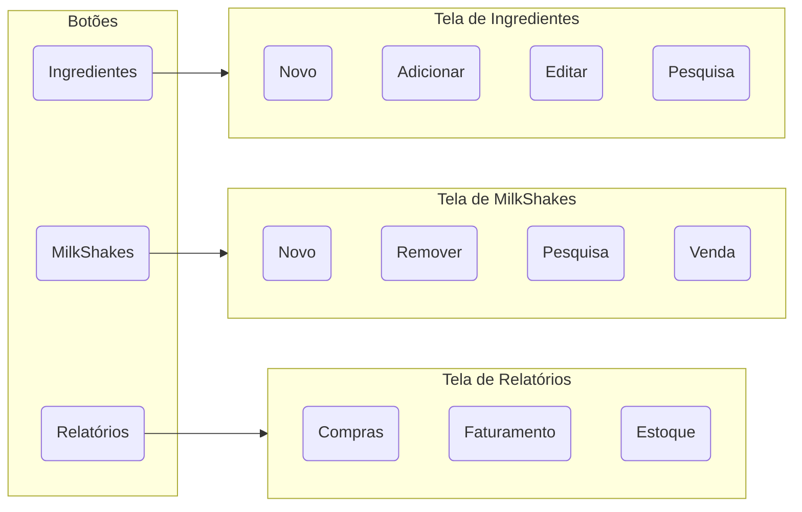

<h1>UFABC_POO_Milk_Shake_Store</h1>
Sistema de estoque de loja de Milk Shake

<h2>Fluxo de Menus</h2>

<h2>Instruções para Desenvolvimento</h2>
<h3>Softwares</h3>
 
 - [Java Coding Pack (VSCode + JDK)](https://aka.ms/vscode-java-installer-win)
 - [Scene Builder](https://download2.gluonhq.com/scenebuilder/18.0.0/install/win/SceneBuilder-18.0.0.msi)

Após instalar os softwares acima o repositório pode ser aberto com o Visual Studio Code para desenvolvimento e teste do código.

Para edição de telas usar o Scene Builder, abrindo os arquivos ***.fxml** que estão localizados na pasta **.\milkshakestore\src\main\resources\com\ufabc\poo**.